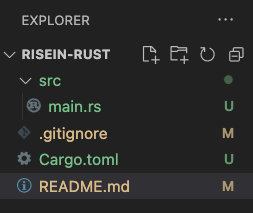
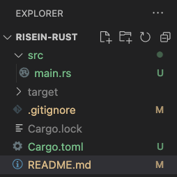
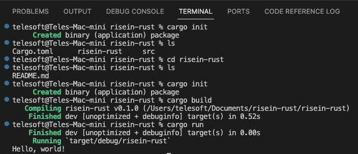
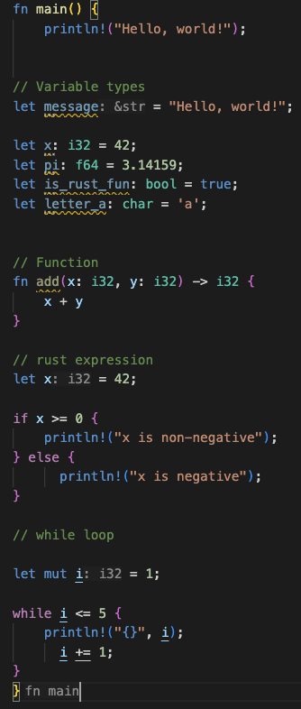
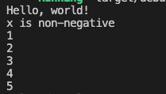

# risein-rust
To practice rust for web 3.0

# clone github repo
- go to github and make new repo "risein-rust"
- go to VS Code and clone this repo
- open terminal in VS Code and navigate to the folder where you cloned repo
- type 

```sh
cargo init
```
to initalize rust project files, which include cargo.toml and main.rs -> src folder



- type 

```sh
cargo check
```
in the terminal to see any errors in the written code

- type 

```sh
cargo build
```
in the terminal to build the binary code (machine code) for project execution. At this point you will notice cargo.lock file





# Let's Code

Now lets see some basic syntax in rust


Now run the code by using above cargo command in the terminal to see the output of the code.
